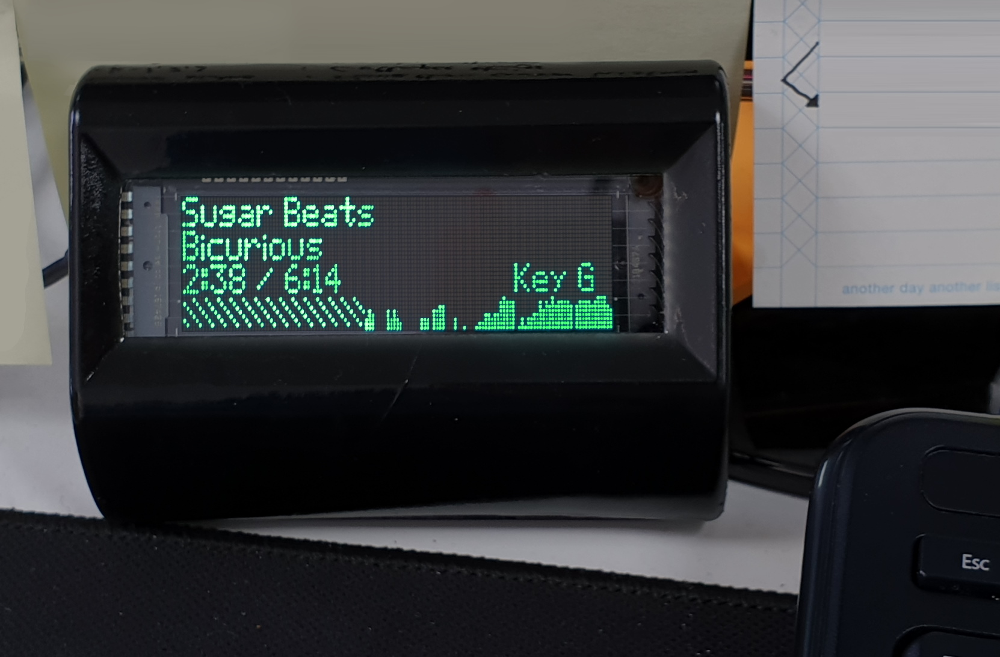

# Spotify Remote Display



Personal project :- a device built to show current playing song info from Spotify.

## Features

- Pi with Node script to handle everything, including web flow OAuth2
- VFD Noritake Noritake Itron GU140X32F-7000 (late 80s tech!)
- Resin printed case

If you want to do some hairbrained homebrew version, I'll ask questions best I can but wouldn't recommend it ^\_- but at the very least, you'll want to edit `spotify-credentials.json`

## Dev

    npm i
    npm start

This should compile to /dist, which is then SFTPd to the Pi.
If you want other files to update on Pi (e.g. a package.json script) git push and pull it properly.

## Installation on Pi

TIP: Add empty ssh to its windows boot dir on SD card, to enable ssh immediately.

https://medium.com/@danidudas/how-to-install-node-js-and-npm-on-any-raspberry-pi-5a82acdfeefc

### Enable serial

sudo raspi-config
interfacing > SPI and i2c > enable those buggers, though not sure i'm using them
interfacing > serial > login shell? NO, enable interface? YES

Run this to check
dmesg | grep tty
It should say console [tty1] enabled - not ttyAMA0

Also open up /boot/config.txt and add:

    enable_uart=1
    dtoverlay=pi3-disable-bt

### Set up WIFI

sudo nano /etc/wpa_supplicant/wpa_supplicant.conf
OR might be able to just save this as wpa_supplicant.conf in the boot dir too!
Hotspot, Home, Work

```conf
country=US
ctrl_interface=DIR=/var/run/wpa_supplicant GROUP=netdev
update_config=1

network={
 ssid="wifiName1"
 psk="wifiPass1"
 key_mgmt=WPA-PSK
}
network={
 ssid="wifiName2"
 psk="wifiPass2"
 key_mgmt=WPA-PSK
 proto=RSN
 pairwise=CCMP
}
```

Disable WIFI power management from disabling it randomly

    sudo nano /etc/rc.local

Add

    sleep 10
    sudo iwconfig wlan0 power off

### THOUGHT PROCESS (for personal ref)

Auth site with app that pings
Lambda function
Saves token to s3

Pi pings lambda for s3 token, or perhaps even just whatever api interaction

Pros:
Standalone rest api kinda cool
Stay alive forever

Cons:
Lots more dev
Possible cost
A little slower

::

Standlone auth site situation:
'click here to auth spotify'
Login to spotify
'click here to auth github'
[somehow not losing the spotify token*]
Save gist
Pi pings gist for auth
Keeps itself alive re-authing .. possibly even updating gist?

Pros:
Standalone auth app extra dev, but fun to build
Cons:
It's yet more oauth2 fuckery, and might lose tokens in the heat of it

:: JUST DO THIS SIMPLE ONE INNIT ::

Pi serves a page
Poss give an ngrok link so no need of same wifi
New tab auth url (always same)
Redirect to static site that just echos it like 'hey, copy this'
Paste back in pi page
Pi saves and goes about its business

Pros:
Easy
No storage

Cons:
If device goes off for an hour, it'll need re-auth

REASONING fOR tO Do ThIs OnE:
I'm just one guy. It's only for me. If I have to phone my way into a IP address and auth it every time it turns on, so be it.

## Troubleshooting

### Nothing on screen?

One time, at band camp, `this.serial.write` was just straight up not doing anything or not firing its callback. A reboot fixed it
